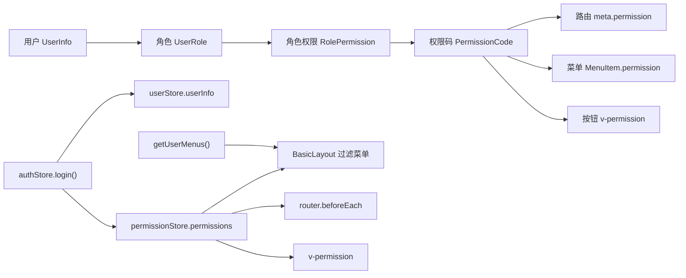

# RBAC 权限设计文档 V1

## 一、文档目标

本文档用于说明 `enterprise-operation-platform` 当前阶段的 RBAC 权限模型设计。

当前项目已经具备登录、路由守卫、菜单过滤、按钮权限指令和 mock 权限数据。V1 阶段的目标不是实现完整后台权限管理页面，而是先把权限系统的基础数据关系沉淀清楚：

- 用户属于某个角色。
- 角色拥有一组权限点。
- 菜单和路由通过权限点控制访问。
- 按钮通过权限点控制展示。
- 前端权限负责体验控制，后端鉴权才是真正的安全边界。

一句话原则：

```text
用户不直接维护权限，用户通过角色获得权限，页面、菜单、按钮都围绕权限码做判断。
```

## 二、当前文件结构

权限相关文件如下：

```text
src/
  api/
    mock/
      rbac.ts
    modules/
      auth.ts
      menu.ts
      user.ts
  directives/
    permission.ts
  layouts/
    BasicLayout.vue
  router/
    index.ts
  stores/
    auth.ts
    permission.ts
    user.ts
  types/
    menu.ts
    permission.ts
    user.ts
```

职责说明：

| 文件                           | 职责                                             |
| ------------------------------ | ------------------------------------------------ |
| `src/types/user.ts`            | 定义用户、角色、登录参数和登录结果类型           |
| `src/types/permission.ts`      | 定义权限码、权限项、角色权限关系类型             |
| `src/types/menu.ts`            | 定义菜单类型，菜单权限码复用 `PermissionCode`    |
| `src/api/mock/rbac.ts`         | 维护 `admin`、`manager`、`operator` 的 mock 权限 |
| `src/api/modules/auth.ts`      | 模拟登录，返回 token 和当前用户信息              |
| `src/api/modules/user.ts`      | 根据 token 模拟恢复当前用户信息                  |
| `src/api/modules/menu.ts`      | 返回带权限码的菜单 mock 数据                     |
| `src/stores/auth.ts`           | 管理 token、登录、恢复会话、退出登录             |
| `src/stores/user.ts`           | 管理当前用户信息和当前用户名                     |
| `src/stores/permission.ts`     | 管理当前权限点、可见菜单路径和权限判断           |
| `src/router/index.ts`          | 根据 `meta.permission` 做页面访问拦截            |
| `src/directives/permission.ts` | 根据权限点控制按钮显示                           |
| `src/layouts/BasicLayout.vue`  | 根据当前权限过滤侧边栏菜单                       |

## 三、RBAC 关系图

当前项目采用简化 RBAC 模型：



数据流如下：

```text
登录账号
  -> authApi.login()
  -> 返回 token 和 userInfo.role
  -> authStore 写入 token 和 userInfo
  -> getPermissionsByRole(role)
  -> permissionStore.permissions
  -> 菜单过滤 / 路由拦截 / 按钮展示
```

刷新恢复流程如下：

```text
localStorage.token
  -> authStore.isLogin 为 true
  -> permissionStore.permissions 为空
  -> authStore.restoreSession()
  -> getUserInfo()
  -> 根据 userInfo.role 重新计算权限
  -> 恢复 userStore 和 permissionStore
```

## 四、角色设计

当前 V1 阶段定义 3 类角色：

| 角色码     | 中文名 | 定位                               |
| ---------- | ------ | ---------------------------------- |
| `admin`    | 管理员 | 平台最高权限，拥有全部菜单和操作   |
| `manager`  | 经理   | 负责业务管理，拥有主要业务操作权限 |
| `operator` | 操作员 | 负责日常处理，只拥有基础查看权限   |

当前登录账号：

| 账号       | 密码     | 角色       |
| ---------- | -------- | ---------- |
| `admin`    | `123456` | `admin`    |
| `manager`  | `123456` | `manager`  |
| `operator` | `123456` | `operator` |

角色类型定义在 `src/types/user.ts`：

```ts
export type UserRole = 'admin' | 'manager' | 'operator'
```

## 五、权限码设计

权限码统一定义在 `src/types/permission.ts`：

```ts
export type PermissionCode =
  | 'dashboard:view'
  | 'customer:list'
  | 'customer:create'
  | 'customer:export'
  | 'order:list'
  | 'order:create'
  | 'order:batch'
  | 'order:update'
  | 'user:list'
  | 'user:create'
  | 'user:update'
  | 'user:assign-role'
  | 'system:manage'
  | 'role:create'
  | 'role:update'
```

命名规则：

```text
资源:动作
```

示例：

| 权限码             | 含义             | 使用位置   |
| ------------------ | ---------------- | ---------- |
| `dashboard:view`   | 查看首页         | 路由、菜单 |
| `customer:list`    | 查看客户列表     | 路由、菜单 |
| `customer:create`  | 新增客户         | 按钮       |
| `customer:export`  | 导出客户         | 按钮       |
| `order:list`       | 查看订单列表     | 路由、菜单 |
| `order:create`     | 创建订单         | 按钮       |
| `order:batch`      | 批量处理订单     | 按钮       |
| `order:update`     | 编辑订单         | 按钮       |
| `user:list`        | 查看用户列表     | 路由、菜单 |
| `user:create`      | 新增用户         | 按钮       |
| `user:update`      | 编辑用户         | 按钮       |
| `user:assign-role` | 分配角色         | 按钮       |
| `system:manage`    | 访问系统管理页面 | 路由、菜单 |
| `role:create`      | 新增角色配置     | 按钮       |
| `role:update`      | 编辑角色配置     | 按钮       |

## 六、字段说明

### 1. 用户字段

`UserInfo` 定义在 `src/types/user.ts`：

| 字段        | 类型         | 说明                 |
| ----------- | ------------ | -------------------- |
| `id`        | `ID`         | 用户唯一标识         |
| `username`  | `string`     | 登录账号             |
| `nickname`  | `string?`    | 页面展示昵称         |
| `avatar`    | `string?`    | 用户头像，当前预留   |
| `role`      | `UserRole`   | 当前用户角色         |
| `status`    | `UserStatus` | 用户状态，启用或禁用 |
| `createdAt` | `string`     | 创建时间             |

当前项目先使用单角色模型：

```text
UserInfo.role: UserRole
```

后续如果需要支持一个用户多个角色，可以扩展为：

```text
UserInfo.roles: UserRole[]
```

### 2. 角色权限字段

`RolePermission` 定义在 `src/types/permission.ts`：

| 字段          | 类型               | 说明                     |
| ------------- | ------------------ | ------------------------ |
| `role`        | `UserRole`         | 角色码                   |
| `permissions` | `PermissionCode[]` | 当前角色拥有的权限码列表 |

当前 mock 数据定义在 `src/api/mock/rbac.ts`：

```ts
export const rolePermissions: RolePermission[] = [
  {
    role: 'admin',
    permissions: []
  }
]
```

`getPermissionsByRole(role)` 负责根据角色返回权限列表：

```text
UserRole
  -> rolePermissions.find()
  -> PermissionCode[]
```

### 3. 权限字段

`PermissionItem` 定义在 `src/types/permission.ts`：

| 字段   | 类型             | 说明         |
| ------ | ---------------- | ------------ |
| `code` | `PermissionCode` | 稳定的权限码 |
| `name` | `string`         | 权限中文名称 |

当前项目 V1 阶段先使用 `PermissionCode` 做判断，`PermissionItem` 作为后续权限管理页面或权限树的扩展类型。

### 4. 菜单字段

`MenuItem` 定义在 `src/types/menu.ts`：

| 字段         | 类型              | 说明                             |
| ------------ | ----------------- | -------------------------------- |
| `id`         | `ID`              | 菜单唯一标识                     |
| `title`      | `string`          | 菜单显示名称                     |
| `path`       | `string`          | 菜单跳转路径，需要和路由路径一致 |
| `name`       | `string?`         | 路由或菜单名称，当前预留         |
| `icon`       | `string?`         | 菜单图标，当前预留               |
| `type`       | `MenuType`        | 菜单类型：目录、菜单、按钮       |
| `parentId`   | `ID?`             | 父级菜单 ID，当前预留给树形菜单  |
| `permission` | `PermissionCode?` | 显示该菜单需要拥有的权限码       |
| `children`   | `MenuItem[]?`     | 子菜单，当前预留给多级菜单       |

菜单权限判断规则：

```text
菜单没有 permission -> 默认可见
菜单有 permission -> 当前用户拥有该权限才可见
```

## 七、角色权限矩阵

当前角色权限关系：

| 权限码             | admin | manager | operator |
| ------------------ | ----- | ------- | -------- |
| `dashboard:view`   | 是    | 是      | 是       |
| `customer:list`    | 是    | 是      | 是       |
| `customer:create`  | 是    | 是      | 否       |
| `customer:export`  | 是    | 是      | 否       |
| `order:list`       | 是    | 是      | 是       |
| `order:create`     | 是    | 是      | 否       |
| `order:batch`      | 是    | 否      | 否       |
| `order:update`     | 是    | 是      | 否       |
| `user:list`        | 是    | 是      | 否       |
| `user:create`      | 是    | 是      | 否       |
| `user:update`      | 是    | 是      | 否       |
| `user:assign-role` | 是    | 否      | 否       |
| `system:manage`    | 是    | 否      | 否       |
| `role:create`      | 是    | 否      | 否       |
| `role:update`      | 是    | 否      | 否       |

菜单可见结果：

| 角色       | 可见菜单                                     |
| ---------- | -------------------------------------------- |
| `admin`    | 首页、客户管理、订单管理、用户管理、系统管理 |
| `manager`  | 首页、客户管理、订单管理、用户管理           |
| `operator` | 首页、客户管理、订单管理                     |

## 八、前端权限控制点

### 1. 菜单权限

菜单数据来自 `getUserMenus()`。

`BasicLayout.vue` 根据 `permissionStore.hasPermissions(menu.permission)` 过滤菜单：

```text
getUserMenus()
  -> MenuItem[]
  -> filter by PermissionCode
  -> AppSidebar
  -> AppSideMenu
```

菜单隐藏只是体验控制，不能替代路由守卫和后端接口鉴权。

### 2. 路由权限

路由通过 `meta.permission` 声明访问页面需要的权限：

```ts
meta: {
  title: '用户管理页',
  requiresAuth: true,
  permission: 'user:list'
}
```

`router.beforeEach()` 判断：

```text
需要登录但未登录 -> 跳转 /login
已登录但权限未恢复 -> restoreSession()
缺少 meta.permission 对应权限 -> 跳转 /403
```

### 3. 按钮权限

按钮使用全局指令 `v-permission`：

```vue
<button v-permission="'user:create'">新增用户</button>
```

指令支持单权限和多权限：

```vue
<button v-permission="['user:create', 'user:update']">操作</button>
```

当前判断规则：

```text
拥有任意一个传入权限 -> 显示按钮
一个都没有 -> 隐藏按钮
```

## 九、前端与后端边界

前端负责：

- 登录后保存当前用户信息。
- 保存当前用户权限列表。
- 根据权限过滤菜单。
- 根据权限拦截路由。
- 根据权限显示或隐藏按钮。
- 刷新页面后恢复用户和权限状态。

后端应该负责：

- 校验 token 是否有效。
- 根据 token 返回真实用户信息。
- 根据用户角色返回真实权限列表。
- 对每个接口做服务端鉴权。
- 拒绝无权限请求。
- 记录关键操作日志。

关键原则：

```text
前端控制“看不看得见”，后端控制“能不能真的做”。
```

即使前端隐藏了按钮，用户仍然可能直接请求接口，所以新增、编辑、删除、导出等接口必须由后端再次鉴权。

## 十、V1 验收标准

当前 V1 阶段完成后，需要满足：

- `admin`、`manager`、`operator` 三种角色可以登录。
- 登录后能根据角色生成不同 `PermissionCode[]`。
- 侧边栏菜单能根据权限过滤。
- 手动访问无权限页面会跳转 `/403`。
- 按钮能通过 `v-permission` 根据权限显示或隐藏。
- 刷新页面后能通过 token 恢复当前用户和权限。
- 菜单权限码和路由权限码保持一致。
- 权限码统一来自 `PermissionCode`，避免散落字符串。

建议验证路径：

```text
admin / 123456
  -> 可见：首页、客户管理、订单管理、用户管理、系统管理

manager / 123456
  -> 可见：首页、客户管理、订单管理、用户管理
  -> 手动访问 /system 跳转 /403

operator / 123456
  -> 可见：首页、客户管理、订单管理
  -> 手动访问 /users 跳转 /403
  -> 手动访问 /system 跳转 /403
```

## 十一、后续扩展方向

后续可以继续扩展：

- 将单角色 `role` 升级为多角色 `roles`。
- 新增权限树，将菜单权限和按钮权限统一成树结构。
- 将 `getUserMenus()` 改成后端按用户返回菜单。
- 将 `getPermissionsByRole()` 改成接口返回真实权限。
- 支持动态路由，根据菜单数据生成路由。
- 支持页面级、按钮级、接口级权限统一配置。
- 增加角色管理和权限分配页面。
